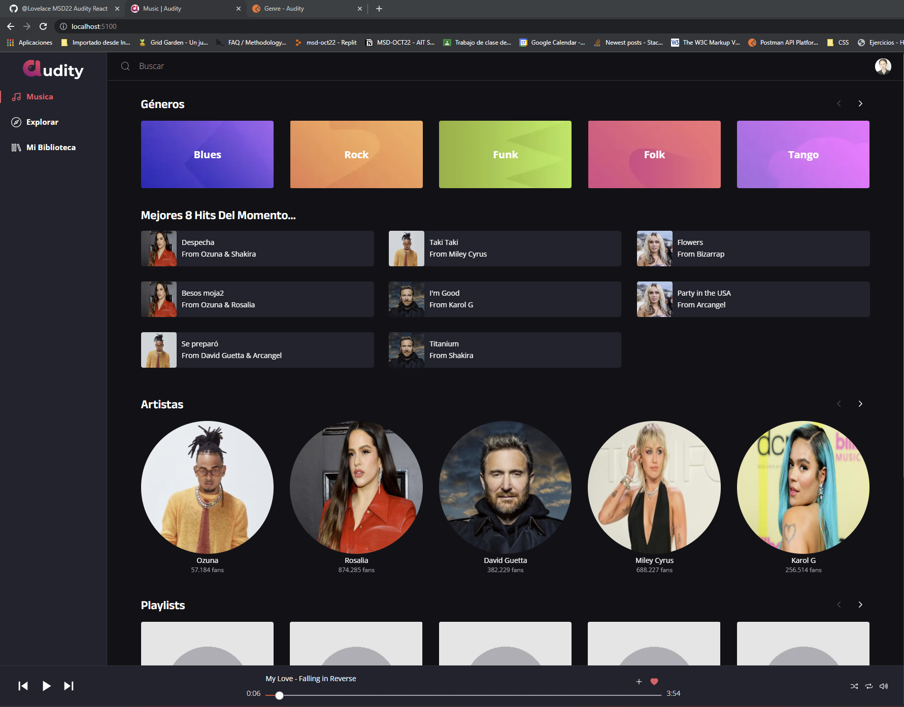
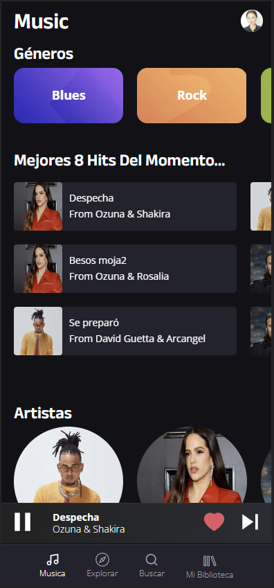
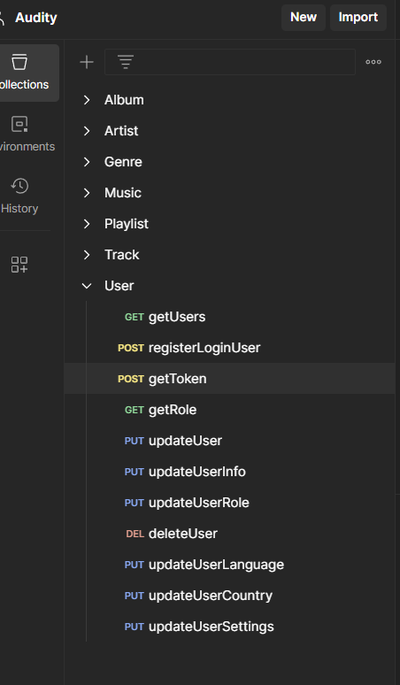
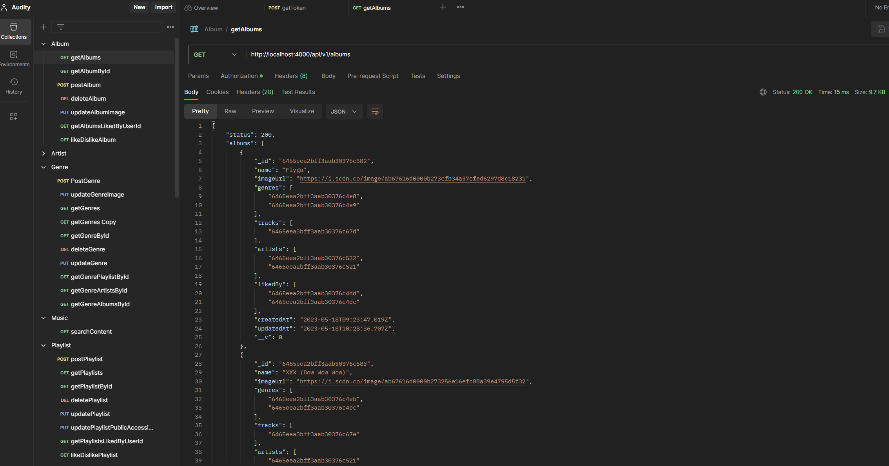

# :headphones: AUDITY Music App
This project proposes the creation of a music web platform based on Spotify/Dreezer. Our team has developed a client-server system, using **NodeJS, Express, MongoDB, Auth0** and **Cloudinary** for the backend implementation. **ReactJS, TypeScript** and **Server-worker** for the frontend. 

*The project is deployed on*: https://audity.dtpf.es/

Desktop:


Mobile:

 


## Technologies :hammer_and_wrench:

- **Node.js**: Node.js is a JavaScript runtime environment that allows developers to run JavaScript code on the server-side. It provides an event-driven architecture and a non-blocking I/O model, making it highly efficient for building scalable and real-time applications.

- **Express**: Express is a fast and minimalist web application framework for Node.js. It provides a set of robust features and utilities for building web applications and APIs. Express simplifies the process of handling HTTP requests, routing, middleware implementation, and serving static files.

- **MongoDB**: MongoDB is a popular NoSQL document-oriented database. It offers a flexible and scalable data model, allowing developers to store and retrieve data in JSON-like documents. MongoDB is known for its high performance, horizontal scalability, and ease of use.

- **Cloudinary**: Cloudinary is a cloud-based media management platform. It provides developers with tools and APIs to upload, store, manipulate, and deliver media assets, such as images, videos, and audio files. Cloudinary offers features like image optimization, resizing, and transformation, making it suitable for handling multimedia storage and delivery in applications.

- **Auth0**: Auth0 is an authentication and authorization platform. It provides developers with pre-built authentication solutions, including user registration, login, and password recovery. Auth0 supports various authentication methods, such as social logins (Google, Facebook, etc.), single sign-on (SSO), and multi-factor authentication (MFA). It also offers role-based access control (RBAC) and user management features, making it easy to implement secure user authentication in applications.

## Installation :computer:
1. Clone the repository: `git clone https://github.com/Lucydct22/audity_node_app.git`
2. Navigate to the project directory: `cd project-directory`
3. Install the dependencies: `npm install`

## Settings
1. Create **.env.development** and **.env.production** (don't forgot create .gitignor for these files)
2. You can see examples on **.env.development.example or see below: 
```
API_VERSION={API_VERSION}
IP_SERVER={IP_SERVER}
PORT_MONGO_DB={PORT_MONGO_DB}
DB_NAME={DB_NAME}
PORT_SERVER={PORT_SERVER}

- Auth0
AUTH0_AUDIENCE={AUTH0_AUDIENCE}
AUTH0_ISSUER={AUTH0_ISSUER}

- Cloudinary
CLOUDINARY_CLOUD_NAME={CLOUDINARY_CLOUD_NAME}
CLOUDINARY_API_KEY={CLOUDINARY_API_KEY}
CLOUDINARY_API_SECRET={CLOUDINARY_API_SECRET}
```

## Development
To run the application in development mode, use the following command:
>npm run dev

This will start the development server and provide hot-reloading for any changes made to the code.

## Production
To build and run the application in production mode, use the following commands:
>npm run build
>npm start

This will build the production-ready code and start the server.

## Controllers
The project includes the following controllers:

* User.controller: Manages user - CRUD.
* Album.controller: Manages album - CRUD.
* Artist.controller: Manages artist - CRUD.
* Genre.controller: Manages genre - CRUD.
* Music.controller: Manages music - CRUD.
* Playlist.controller: Manages playlist - CRUD.
* Track.controller: Manages track - CRUD.

## Seeders
Seeders are provided for development purposes. They allow you to populate the database with sample data. To run the seeders, use the following command:
1. Connect your MongoDB Compass
2. Go index.js
3. Uncomment all *await seeder.seedXXX()*
4. Raise the server with *npm run dev*
5. Comment all *await seeder.seedXXX()* again
6. Upload MongoDB Compass

## Middlewares
The project includes the following middlewares:
- **ensureAuth**: Verifies if a user is logged in,
- **ensureAdminAuth**: Checks if a user has admin privileges,
- **error**: To get errors messages

## Routes
Almost all routes in the application are protected using ensureAuth. Users need to authenticate to access some of actions (like a give like/dislike).

## Postman
The list of folders:



Example *getAlbums*:



## Endpoints
   **ALBUMS**
| ENDPOINT                               | METHOD |RESULT                          |
|----------------------------------------|--------|---------------------------------|
| '/album'                               | POST   | Create album (just admin)       |
| '/albums'                              | GET    | Get all albums                  |
| '/album/:albumId'                      | GET    | Get album by id                 |
| '/album/:albumId'                      | DELETE | Delete album by id (just admin) |
| '/albums-liked-by-user/:userId'        | GET    | Get all albums liked by user    |
| '/like-dislike-album/:albumId/:userId' | GET    | Put like/dislike to album       |
| '/album-image/:albumId'                | PUT    | Change album cover img          |
| '/album/:albumId'                      | PUT    | Update Album                    |

   **ARTIST**
| ENDPOINT                                 | METHOD |RESULT                           |
|------------------------------------------|--------|---------------------------------|
| '/artist'                                | POST   | Create artist (just admin)      |
| '/artist/:artistId'                      | GET    | Get artist by id                |
| '/artist/:artistId'                      | PUT    | Update artist by id             |
| '/artist/:artistId'                      | DELETE | Delete artist by id (just admin)|
| '/artists'                               | GET    | Get all artists                 |
| '/artists-liked-by-user/:userId'         | GET    | Get all artists liked by user   |
| '/like-dislike-artist/:artistId/:userId' | GET    | Put like/dislike to artist      |
| '/artist-image/:artistId'                | PUT    | Update artist cover img         |

   **ARTIST**
| ENDPOINT                                 | METHOD |RESULT                           |
|------------------------------------------|--------|---------------------------------|
| '/artist'                                | POST   | Create artist (just admin)      |
| '/artist/:artistId'                      | GET    | Get artist by id                |
| '/artist/:artistId'                      | PUT    | Update artist by id             |
| '/artist/:artistId'                      | DELETE | Delete artist by id (just admin)|
| '/artists'                               | GET    | Get all artists                 |
| '/artists-liked-by-user/:userId'         | GET    | Get all artists liked by user   |
| '/like-dislike-artist/:artistId/:userId' | GET    | Put like/dislike to artist      |
| '/artist-image/:artistId'                | PUT    | Update artist cover img         |

   **GENRE**
| ENDPOINT                | METHOD |RESULT                     |
|-------------------------|--------|---------------------------|
| '/genres'               | GET    | Get all genres            |
| '/genre/:id'            | GET    | Get genre by id           |
| '/genre/:id/playlists'  | GET    | Playlists with genre      |
| '/genre/:id/albums'     | GET    | Albums with genre         |
| '/genre/:id/artists'    | GET    | Artists with genre        |
| '/genre'                | POST   | Create genre (just admin) |
| '/genre-image/:genreId' | PUT    | Update genre cover img    |
| '/update-genre/:id'     | PUT    | Update genre              |
| '/delete-genre/:id'     | DELETE | Delete genre (just admin) |

  **SEARCH**
| ENDPOINT                 | METHOD |RESULT               |
|--------------------------|--------|---------------------|
| '/search-content/:query' | GET    | Search with query   |

  **PLAYLIST**
| ENDPOINT                                                            | METHOD |RESULT                           |
|---------------------------------------------------------------------|--------|---------------------------------|
| '/playlist'                                                         | POST   | Create plailist private         |
| '/playlists'                                                        | GET    | Get all plailists               |
| '/playlist/:id'                                                     | GET    | Get plailist by id              |
| '/update-playlist/:id'                                              | PUT    | Update playlist                 |
| '/playlist/:playlistId'                                             | DELETE | Delete playlist                 |
| '/playlists-liked-by-user/:userId'                                  | GET    | Get playlists liked by user     |
| '/like-dislike-playlist/:playlistId/:userId'                        | GET    | Put like/dislike                |
| '/playlists-by-user/:userId'                                        | GET    | Get playlists of user           |
| '/playlist-add-track/playlists/:playlistId/tracks/:trackId'         | PUT    | Put track to playlist           |
| '/delete-track-from-playlist/playlists/:playlistId/tracks/:trackId' | DELETE | Delete track from playlist      |
| '/playlist-admin'                                                   | POST   | Create playlist by admin public |
| '/playlist-image/:playlistId'                                       | PUT    | Update cover img                |
| '/playlist-admin/:playlistId'                                       | PUT    | Update playlist by admin        |
| '/update-public-accessible/:playlistId'                             | PUT    | Make public/private             |
| '/all-playlists'                                                    | GET    | Get all playlists               |

**TRACK**

**USER**

## Dependencies
> npm i --save:
- Cors
- Bson
- express-fileupload
- fs-extra
- helmet
- nodemon
- auth0
- cloudinary
- dotenv
- express
- express-oauth2-jwt-bearer

## Authors :brain:
This project was done by:

- FULLSTACK DEVELOPOR and Scrum master[David T. Pizarro](https://github.com/DTPF)
- FULLSTACK DEVELOPOR [Joe Joy](https://github.com/joejoyjoy)
- FULLSTACK DEVELOPOR [Iuliia Shikhanova](https://github.com/IuliiaNova)
- FULLSTACK DEVELOPOR [Javier Pascual](https://github.com/Javier-jpt)
- FULLSTACK DEVELOPOR [Lucia Tena](https://github.com/Lucydct22)


Thanks go to these wonderful people (✨](https://allcontributors.org/docs/en/emoji-key)):

<!-- ALL-CONTRIBUTORS-LIST:START - Do not remove or modify this section -->
<!-- prettier-ignore-start -->
<!-- markdownlint-disable -->
<table>
  <tbody>
    <tr>
      <td align="center">
        <a href="https://github.com/DTPF">
          
          <br />
          <sub>
          <b>David T. Pizarro Frick</b>
          </sub>
        </a>
        <br />
        <a href="#tools-dtpf" title="code-tools-maintenance">💻🔧🚧</a>
      </td>
      <td align="center">
        <a href="https://github.com/joejoyjoy">
          
          <br />
          <sub>
          <b>Joe Alt</b>
          </sub>
        </a>
        <br />
        <a href="#tools-joealt" title="code-tools-maintenance">💻🔧🚧</a>
      </td>
      <td align="center">
        <a href="https://github.com/IuliiaNova">
          
          <br />
          <sub>
          <b>Iuliia Shikhanova</b>
          </sub>
        </a>
        <br />
        <a href="#code-luliianova" title="code-tools-maintenance">💻🔧🚧</a>
      </td>
      <td align="center">
        <a href="https://github.com/Lucydct22">
          
          <br />
          <sub>
          <b>lucia del cacho</b>
          </sub>
        </a>
        <br />
        <a href="#code-lucydct22" title="code-tools-maintenance">💻🔧🚧</a>
      </td>
      <td align="center">
        <a href="https://github.com/Javier-jpt">
          
          <br />
          <sub>
          <b>Javier Pascual Tunez</b>
          </sub>
        </a>
        <br />
        <a href="#code-javier-jpt" title="code-tools-maintenance">💻🔧🚧</a>
      </td>
    </tr>
  </tbody>
</table>

This project follows the [all-contributors](https://allcontributors.org) specification.
Contributions of any kind are welcome!
